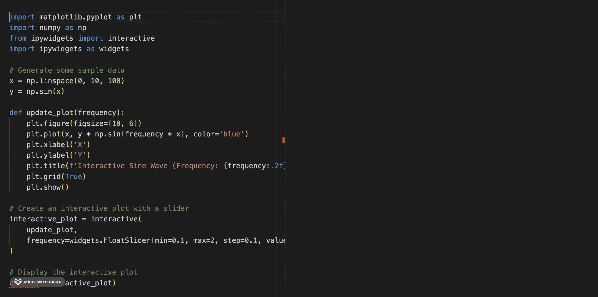

# Saccade: Rapid Python Eval

Evaluate blocks of Python code in an [interactive window](https://code.visualstudio.com/docs/python/jupyter-support-py#_using-the-python-interactive-window) without having to add explicit "cell" delimiters or other notebook-y metadata. Work in plain python files, and still benefit from notebook-like feedback.

By default `ctrl-enter` evaluates the current block and stays there, `shift-enter` evaluates & moves to the next block.

The "current top-level block" is:
* the current line, function, or class, plus:
* any adjacent blocks not separated by a blank line

> Saccades are rapid, ballistic movements of the eyes that abruptly change the point of fixation [[1](https://www.ncbi.nlm.nih.gov/books/NBK10991/#:~:text=Saccades%20are%20rapid%2C%20ballistic%20movements,while%20gazing%20around%20a%20room.)]. Saccades are one of the fastest movements produced by the human body [[2](https://www.mdpi.com/2313-433X/8/3/76#:~:text=Saccades%20are%20one%20of%20the,25%20°%20of%20visual%20angle)]. The primary function of saccades is to bring new objects of interest on to the fovea [[3](https://www.uni-muenster.de/imperia/md/content/psyifp/ae_lappe/heins__f.__lappe__m.22.pdf)]. This allows the visual system to scan the environment quickly and efficiently, building up a detailed mental image despite having high resolution in only a small part of the retina.

## Features

- Automatically detect code cells based on function/class, contiguous regions, and configurable cell markers. No need to pollute your python files with cell metadata.
- Supports both code and markdown cells
- Visual feedback with cell highlighting
- Compatible with Jupyter notebooks and Python scripts using [Jupytext "light" format](https://jupytext.readthedocs.io/en/latest/formats-scripts.html#the-light-format)
- Integrates with VS Code's Python Interactive Window

## Requirements

- Visual Studio Code v1.90.0 or higher
- Python extension for VS Code

## Extension Settings

This extension contributes the following settings:

* `saccade.enabledCellMarkers`: An array of strings that define the cell markers. Default: `["# +", "# %%"]`

---

## Contributing

Contributions are welcome! Please feel free to submit a Pull Request.

## License

This extension is licensed under the [MIT License](LICENSE).
